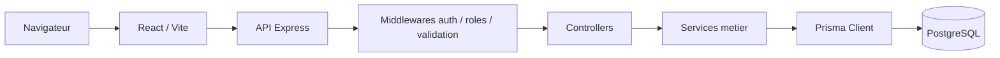

# Architecture du projet

## Vue d'ensemble

Frovely est une application full-stack separee en deux workspaces npm:

- `frontend`: interface React construite avec Vite.
- `backend`: API REST Express connectee a PostgreSQL via Prisma.

La base locale est fournie par Docker Compose. Le deploiement cible est documente dans `docs/deployment.md`.

## Arborescence utile

```text
backend/
  prisma/
    migrations/      Migrations SQL Prisma
    schema.prisma    Modele de donnees
    seed.js          Seed categories + admin
  src/
    config/          Configuration env et Prisma
    controllers/     Entrees HTTP
    data/            Catalogue d'abonnements
    middlewares/     Auth, roles, validation, erreurs, CSRF
    routes/          Definition des routes API
    services/        Logique metier
    validators/      Schemas Zod
    app.js           App Express
    server.js        Demarrage HTTP

frontend/
  public/            Assets publics utiles
  src/
    api/             Client API
    components/      Composants UI reutilisables
    context/         Contexte d'authentification
    hooks/           Hooks metier
    i18n/            Dictionnaires FR/EN
    pages/           Pages principales
    utils/           Fonctions utilitaires
```

## Flux principal



## Choix techniques

### React + Vite

React fournit une UI composable et testable. Vite simplifie le developpement local avec un serveur rapide et une configuration minimale.

### Express

Express est utilise pour construire une API REST claire, decoupee par domaine fonctionnel: auth, abonnements, categories, admin et catalogue.

### Prisma + PostgreSQL

Prisma centralise le modele de donnees et genere un client type-safe. PostgreSQL est adapte aux relations entre utilisateurs, categories et abonnements.

### Zod

Zod valide les entrees HTTP avant l'execution de la logique metier. Cela reduit les erreurs de format et protege les services.

### Cookie HTTP-only

Le JWT est stocke dans un cookie HTTP-only afin de limiter l'exposition du token au JavaScript frontend.

### Vitest, Supertest et Testing Library

Les tests couvrent les services, les routes API et les comportements frontend principaux. Ils servent de filet de securite pour les evolutions.

## API principale

Prefixe: `/api`

| Domaine | Routes |
|---|---|
| Auth | `/auth/register`, `/auth/login`, `/auth/me`, `/auth/logout`, `/auth/verify-email`, `/auth/forgot-password`, `/auth/reset-password`, `/auth/csrf` |
| Abonnements | `/subscriptions`, `/subscriptions/:id`, `/subscriptions/:id/permanent` |
| Categories | `/categories`, `/categories/:id` |
| Admin | `/admin/users`, `/admin/users/:id`, `/admin/subscriptions`, `/admin/subscriptions/:id` |
| Catalogue | `/catalog/subscriptions` |

## Environnements

### Local

- Frontend: `http://localhost:5173`
- Backend: `http://localhost:4000/api`
- PostgreSQL: `localhost:15432`

### Production

La production demande:

- une base PostgreSQL distante;
- un `JWT_SECRET` fort;
- des origines CORS explicites;
- des cookies `Secure`;
- des variables d'environnement configurees cote hebergeur.

## Qualite et verification

Commandes principales:

```bash
npm test
npm run build
npm audit --omit=dev
```
