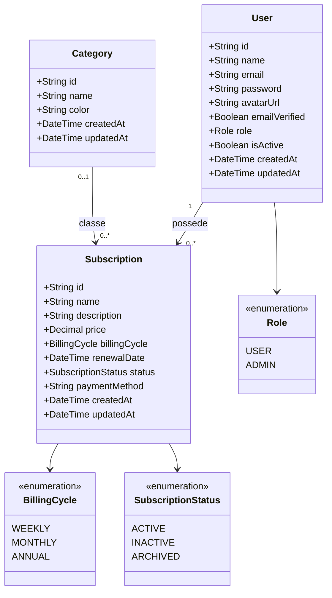

# Conception UML et MERISE

## Diagramme de cas d'utilisation

```mermaid
flowchart TD
  Visitor["Visiteur"]
  User["Utilisateur"]
  Admin["Administrateur"]
  System["Frovely"]

  Visitor --> Register["S'inscrire"]
  Visitor --> Login["Se connecter"]
  Visitor --> ResetPassword["Reinitialiser son mot de passe"]
  Visitor --> VerifyEmail["Verifier son email"]

  User --> ManageSubscriptions["Gerer ses abonnements"]
  User --> ViewDashboard["Consulter le dashboard"]
  User --> ViewAnalytics["Consulter les statistiques"]
  User --> ManageProfile["Modifier son profil"]
  User --> SearchCatalog["Rechercher dans le catalogue"]
  User --> Logout["Se deconnecter"]

  Admin --> ManageUsers["Administrer les utilisateurs"]
  Admin --> ManageCategories["Administrer les categories"]
  Admin --> ViewAllSubscriptions["Consulter tous les abonnements"]

  Register --> System
  Login --> System
  ResetPassword --> System
  VerifyEmail --> System
  ManageSubscriptions --> System
  ViewDashboard --> System
  ViewAnalytics --> System
  ManageProfile --> System
  SearchCatalog --> System
  Logout --> System
  ManageUsers --> System
  ManageCategories --> System
  ViewAllSubscriptions --> System
```



## Diagramme de classes



## Modele Conceptuel de Donnees

### Entites

#### USER

- id
- name
- email
- password
- avatar_url
- email_verified
- email_verification_token_hash
- email_verification_token_expires_at
- password_reset_token_hash
- password_reset_token_expires_at
- role
- is_active
- created_at
- updated_at

#### CATEGORY

- id
- name
- color
- created_at
- updated_at

#### SUBSCRIPTION

- id
- name
- description
- price
- billing_cycle
- renewal_date
- status
- payment_method
- created_at
- updated_at

### Associations

| Association | Cardinalite | Description |
|---|---|---|
| USER - SUBSCRIPTION | 1,n | Un utilisateur possede zero, un ou plusieurs abonnements. Un abonnement appartient a un seul utilisateur. |
| CATEGORY - SUBSCRIPTION | 0,n | Une categorie peut classer plusieurs abonnements. Un abonnement peut ne pas avoir de categorie. |

## Modele Logique de Donnees

```text
USERS(
  id PK,
  name,
  email UNIQUE,
  password,
  avatar_url NULL,
  email_verified,
  email_verification_token_hash NULL,
  email_verification_token_expires_at NULL,
  password_reset_token_hash NULL,
  password_reset_token_expires_at NULL,
  role,
  is_active,
  created_at,
  updated_at
)

CATEGORIES(
  id PK,
  name UNIQUE,
  color,
  created_at,
  updated_at
)

SUBSCRIPTIONS(
  id PK,
  name,
  description NULL,
  price DECIMAL(10,2),
  billing_cycle,
  renewal_date,
  status,
  payment_method NULL,
  user_id FK -> USERS(id),
  category_id FK NULL -> CATEGORIES(id),
  created_at,
  updated_at
)
```

## Contraintes d'integrite

- `users.email` est unique.
- `categories.name` est unique.
- `subscriptions.user_id` est obligatoire.
- Suppression d'un utilisateur: suppression en cascade de ses abonnements.
- Suppression d'une categorie: `category_id` passe a `NULL` sur les abonnements.
- `subscriptions.user_id` et `subscriptions.category_id` sont indexes.
- Les valeurs de role, cycle et statut sont limitees par des enums.
