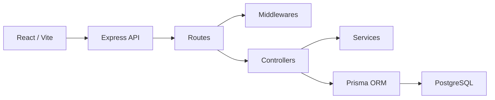
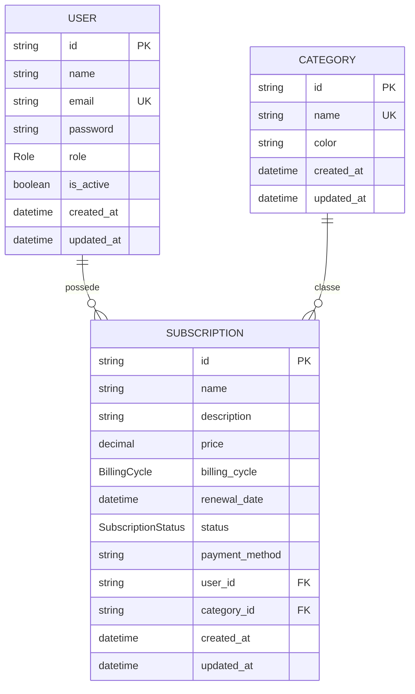

# Conception

## Objectif

Subscription Manager est une application web de gestion d'abonnements. Elle permet à un utilisateur de suivre ses services, leurs coûts et leurs renouvellements. Un administrateur peut gérer les comptes et consulter les abonnements présents sur la plateforme.

Le projet respecte une organisation MVC côté backend et une séparation par pages/composants côté frontend.

## Architecture MVC



### Model

Le modèle est géré avec Prisma et PostgreSQL.

Entités principales:

- `User`
- `Subscription`
- `Category`

Les enums Prisma structurent les rôles, statuts et cycles:

- `Role`: `USER`, `ADMIN`
- `BillingCycle`: `MONTHLY`, `ANNUAL`, `WEEKLY`
- `SubscriptionStatus`: `ACTIVE`, `INACTIVE`, `ARCHIVED`

### View

La vue est réalisée avec React, Vite et Tailwind CSS.

Pages principales:

- Authentification
- Dashboard
- Abonnements
- Analytics
- Profile
- Admin

Le frontend utilise les cookies HTTP-only via `credentials: "include"` et ne manipule pas directement le JWT.

### Controller

Les controllers Express gèrent la logique métier:

- Authentification
- Abonnements utilisateur
- Catégories
- Utilisateurs admin
- Abonnements admin

Les middlewares gèrent:

- Authentification
- Autorisation admin
- Validation Zod
- Gestion des erreurs
- Sécurité HTTP

## MCD simplifié



## MLD simplifié

```txt
users(
  id UUID PRIMARY KEY,
  name TEXT NOT NULL,
  email TEXT UNIQUE NOT NULL,
  password TEXT NOT NULL,
  role Role DEFAULT USER,
  is_active BOOLEAN DEFAULT true,
  created_at TIMESTAMP,
  updated_at TIMESTAMP
)

categories(
  id UUID PRIMARY KEY,
  name TEXT UNIQUE NOT NULL,
  color TEXT DEFAULT '#2563eb',
  created_at TIMESTAMP,
  updated_at TIMESTAMP
)

subscriptions(
  id UUID PRIMARY KEY,
  name TEXT NOT NULL,
  description TEXT NULL,
  price DECIMAL(10, 2) NOT NULL,
  billing_cycle BillingCycle NOT NULL,
  renewal_date TIMESTAMP NOT NULL,
  status SubscriptionStatus DEFAULT ACTIVE,
  payment_method TEXT NULL,
  user_id UUID NOT NULL REFERENCES users(id) ON DELETE CASCADE,
  category_id UUID NULL REFERENCES categories(id) ON DELETE SET NULL,
  created_at TIMESTAMP,
  updated_at TIMESTAMP
)
```

## Règles métier

- Un utilisateur standard ne voit que ses abonnements.
- Un admin peut gérer les utilisateurs.
- Un admin peut consulter tous les abonnements.
- La suppression d'un abonnement par un utilisateur archive l'abonnement.
- La suppression d'un abonnement par un admin est définitive.
- Un admin ne peut pas supprimer son propre compte.
- Les nouveaux inscrits sont `USER` par défaut.
- Le total mensuel ne prend en compte que les abonnements `ACTIVE`.

## Calcul mensualisé

```txt
MONTHLY = prix
ANNUAL  = prix / 12
WEEKLY  = prix * 4.33
```

Ce calcul sert au dashboard, aux statistiques et aux totaux côté API.

## Sécurité

Mesures déjà en place:

- Hash des mots de passe avec bcrypt.
- JWT signé côté backend.
- JWT stocké dans un cookie HTTP-only.
- Pas de stockage du token dans le frontend.
- Middleware `requireAuth` pour les routes privées.
- Middleware `requireAdmin` pour les routes admin.
- Validation des entrées avec Zod.
- Helmet pour les en-têtes HTTP de sécurité.
- Rate-limit sur `POST /api/auth/login` et `POST /api/auth/register`.
- CORS configuré par origine autorisée.
- `JWT_SECRET` renforcé en production.
- Cookies configurables avec `Secure` et `SameSite`.

Limite connue:

- La protection CSRF dédiée n'est pas encore implémentée. Pour une mise en production grand public, il faut ajouter un token CSRF ou une validation stricte des en-têtes `Origin` / `Sec-Fetch-Site` sur les routes qui modifient des données.

## Choix techniques

| Choix | Justification |
|---|---|
| React | Interface dynamique, composants réutilisables, bonne base pour mobile-first |
| Vite | Démarrage rapide, build simple, adapté aux projets React modernes |
| Tailwind CSS | Production rapide d'une interface responsive sans framework UI lourd |
| Express | API REST simple, lisible et adaptée au niveau du projet |
| Prisma | Migrations propres, modèle relationnel lisible, requêtes sécurisées |
| PostgreSQL | Base relationnelle robuste pour users, subscriptions et categories |
| JWT cookie HTTP-only | Session plus sûre qu'un token stocké dans `localStorage` |
| Docker | Base locale reproductible sur les machines de développement |
| Vitest | Tests rapides pour backend et frontend |

## Organisation du code

```txt
backend/
  prisma/
  src/
    config/
    controllers/
    middlewares/
    routes/
    services/
    utils/
    validators/
  tests/

frontend/
  src/
    components/
    context/
    i18n/
    pages/
    services/
    utils/
```

## Limites connues et améliorations futures

- Ajouter une vraie protection CSRF.
- Ajouter une récupération de mot de passe.
- Ajouter des notifications de renouvellement.
- Ajouter une vraie gestion des moyens de paiement.
- Ajouter un export CSV/PDF.
- Ajouter plus de tests end-to-end navigateur.
- Ajouter un monitoring production.
