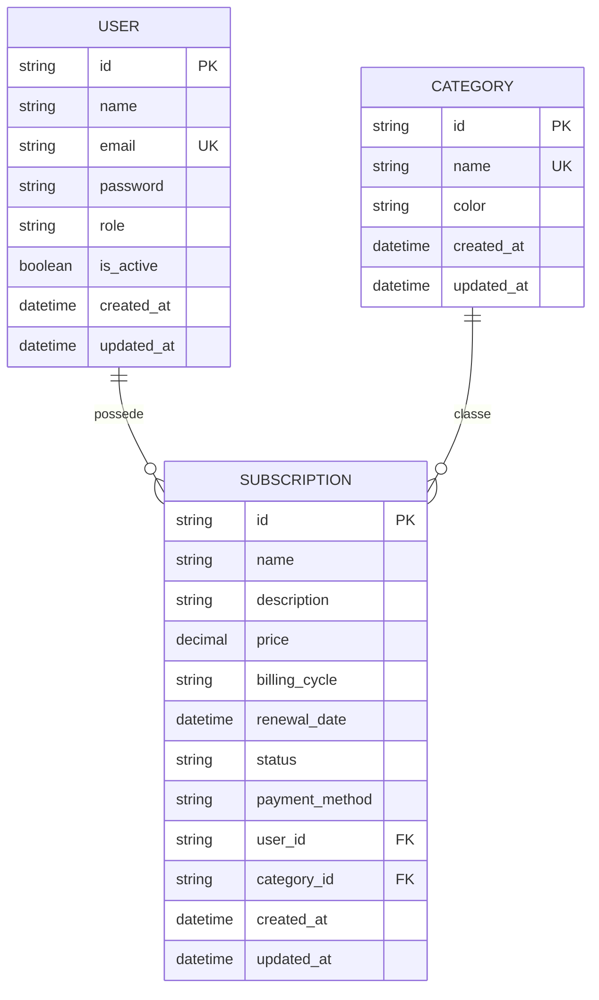
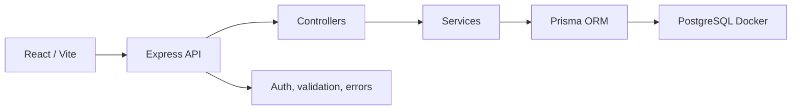

# Conception

## Architecture MVC

- Model: Prisma, PostgreSQL, modèles `User`, `Subscription`, `Category`
- View: React, composants et pages frontend
- Controller: Express controllers, routes REST et middlewares

## MCD simplifié



## MLD simplifié

```txt
users(
  id PK,
  name,
  email UNIQUE,
  password,
  role,
  is_active,
  created_at,
  updated_at
)

categories(
  id PK,
  name UNIQUE,
  color,
  created_at,
  updated_at
)

subscriptions(
  id PK,
  name,
  description,
  price,
  billing_cycle,
  renewal_date,
  status,
  payment_method,
  user_id FK -> users(id),
  category_id FK -> categories(id),
  created_at,
  updated_at
)
```

## Sécurité

- Les mots de passe sont hashés avec bcrypt.
- Le JWT est stocké dans un cookie HTTP-only.
- Les routes privées passent par un middleware d'authentification.
- Les routes admin passent par un middleware de rôle.
- Les utilisateurs ne peuvent accéder qu'à leurs propres abonnements.

## Architecture MVC



## Choix techniques

- React/Vite: frontend léger, rapide à développer et adapté à une interface dynamique.
- Tailwind CSS: permet une UI responsive rapidement sans dépendre d'un kit graphique lourd.
- Express: framework simple et robuste pour exposer une API REST.
- Prisma: ORM lisible, migrations versionnées, typage des modèles et requêtes plus sûres.
- PostgreSQL: base relationnelle adaptée aux relations `users`, `subscriptions`, `categories`.
- JWT cookie HTTP-only: évite de manipuler le token en JavaScript côté navigateur.

## Bonus possibles

- Graphiques avancés
- Notifications de renouvellement
- Export CSV/PDF
- Déploiement Vercel + Render/Railway
- Tests d'intégration complets
