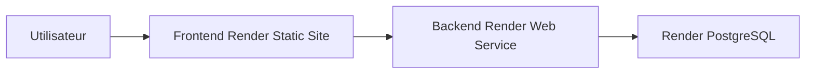

# Deploiement Render

## Objectif

Cette documentation decrit la configuration de production Render preparee pour le projet.

Le projet est un monorepo npm:

- Frontend: React + Vite, heberge en Static Site Render.
- Backend: Express, heberge en Web Service Node Render.
- Base de donnees: PostgreSQL Render.
- ORM: Prisma.
- Seed: `backend/prisma/seed.js`, idempotent avec `upsert`.

## Architecture de production


```mermaid
flowchart LR
  User["Utilisateur"] --> Frontend["Frontend Render Static Site"]
  Frontend --> Api["Backend Render Web Service"]
  Api --> Db["Render PostgreSQL"]
```

## Blueprint Render

La configuration principale est dans `render.yaml` a la racine du depot.

Elle cree:

- `frovely-api`: service web Node.
- `frovely-web`: site statique Vite.
- `frovely-db`: base PostgreSQL.
- `frovely-renewal-reminders`: cron job Node toutes les quinze minutes.

Configuration backend:

- Build command: `npm run render:build:backend`
- Start command: `npm run render:start:backend`
- Health check: `/api/health`

Configuration frontend:

- Build command: `npm run render:build:frontend`
- Publish directory: `./frontend/dist`
- SPA rewrite: `/*` vers `/index.html`

## Variables Render

Backend:

```env
NODE_ENV=production
CLIENT_ORIGIN=https://app.frovely.app
CLIENT_ORIGINS=https://app.frovely.app
DATABASE_URL=<genere depuis frovely-db>
JWT_SECRET=<genere automatiquement par Render>
JWT_EXPIRES_IN=7d
COOKIE_NAME=frovely_session
COOKIE_SECURE=true
COOKIE_SAME_SITE=lax
CSRF_COOKIE_NAME=frovely_csrf
CSRF_HEADER_NAME=x-csrf-token
RESEND_API_KEY=<a renseigner dans Render>
EMAIL_FROM=Frovely <support@domaine-verifie>
EMAIL_REPLY_TO=support@frovely.app
PUBLIC_REGISTRATION_ENABLED=false
BETA_INVITE_ONLY=true
BETA_INVITE_LIMIT=30
BETA_ACCESS_ENABLED=true
PREMIUM_FEATURES_ENABLED=false
AUTH_RATE_LIMIT_WINDOW_MS=900000
AUTH_RATE_LIMIT_MAX=10
ADMIN_EMAIL=<a renseigner dans Render>
ADMIN_PASSWORD=<a renseigner dans Render>
ADMIN_NAME=Frovely Admin
```

Frontend:

```env
VITE_API_URL=https://api.frovely.app/api
```

Ces valeurs ne doivent etre activees qu'apres l'achat de `frovely.app`, le rattachement DNS et l'emission des certificats HTTPS par Render.

## Base de donnees, migrations et seed

Prisma utilise `DATABASE_URL`.

Commandes utiles:

```bash
npm run db:generate
npm run db:deploy
npm run db:seed
```

Sur Render:

- `render:start:backend` lance `prisma migrate deploy`, execute le seed idempotent, puis demarre le backend.
- Le seed est idempotent: les categories et l'admin sont crees/mis a jour avec `upsert`.

## Deploiement depuis Render

1. Pousser le projet sur GitHub avec `render.yaml`.
2. Dans Render, choisir `New` puis `Blueprint`.
3. Connecter le repository GitHub du projet.
4. Confirmer le blueprint.
5. Renseigner les variables demandees:
   - `RESEND_API_KEY`
   - `ADMIN_EMAIL`
   - `ADMIN_PASSWORD`
6. Laisser Render creer la base, le backend et le frontend.
7. Une fois les deux URLs publiques creees, verifier qu'elles correspondent aux valeurs du blueprint.

## Securite production

Mesures presentes:

- Helmet pour les en-tetes HTTP.
- Rate-limit sur login/register.
- Cookie HTTP-only pour le JWT.
- Cookie `Secure` obligatoire en production.
- `SameSite=Lax` pour les sous-domaines `app` et `api` du même domaine Frovely.
- CORS par allowlist stricte via `CLIENT_ORIGIN` et `CLIENT_ORIGINS`.
- Protection CSRF avec le header `x-csrf-token`.
- Validation Zod sur les routes sensibles.
- Mot de passe hashe avec bcrypt.
- `JWT_SECRET` genere par Render et valide par le schema d'environnement.

## Verification apres deploiement

Verifier:

- `https://api.<domaine-frovely>/api/health`
- Chargement du frontend public.
- Creation d'une invitation beta par un administrateur, puis inscription depuis le lien prive.
- Verification email via Resend.
- Connexion utilisateur.
- Creation, modification et archivage d'un abonnement.
- Dashboard, analytics, profil et admin.
- Cookies presents en HTTPS.
- CORS sans erreur dans la console navigateur.

## Limites a surveiller

- Le service web gratuit peut se mettre en veille ; le cron Render est facturé séparément.
- Un domaine Resend vérifié est nécessaire pour envoyer à de vrais utilisateurs.
- Les valeurs `sync: false` de `render.yaml` sont à renseigner dans Render, jamais dans Git.
- Le stockage d'avatar reste externe uniquement via URL HTTPS.
