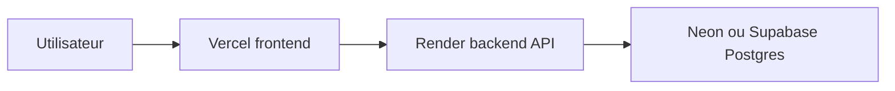

# Deploiement pre-prod gratuit

## Objectif

Cette documentation decrit la pre-production gratuite retenue pour Frovely:

- Frontend: React + Vite sur Vercel.
- Backend: Express sur Render Web Service free.
- Base de donnees: PostgreSQL externe sur Neon ou Supabase.
- ORM: Prisma.
- Seed: `backend/prisma/seed.js`, idempotent avec `upsert`.
- Rappels email: script backend disponible, sans cron automatique gratuit pour le moment.

## Architecture


```mermaid
flowchart LR
  User["Utilisateur"] --> Frontend["Vercel frontend"]
  Frontend --> Api["Render backend API"]
  Api --> Db["Neon ou Supabase Postgres"]
```

## Base de donnees

Choisir une base PostgreSQL gratuite:

- Neon: recommande pour une pre-prod simple avec Prisma.
- Supabase: possible aussi, en utilisant la connection string compatible Prisma.

La valeur a recuperer sera utilisee dans Render:

```env
DATABASE_URL=<connection string PostgreSQL Neon ou Supabase>
```

Prisma utilise `DATABASE_URL` pour les migrations, le seed et l'application.

## Backend Render

Le fichier `render.yaml` ne cree maintenant que l'API:

- `frovely-api`: service web Node.

Configuration:

- Runtime: Node
- Plan: Free
- Build command: `npm run render:build:backend`
- Start command: `npm run render:start:backend`
- Health check path: `/api/health`

Variables Render backend:

```env
NODE_ENV=production
CLIENT_ORIGIN=https://<url-vercel>
CLIENT_ORIGINS=https://<url-vercel>
DATABASE_URL=<connection string PostgreSQL Neon ou Supabase>
JWT_SECRET=<genere automatiquement par Render ou secret fort>
JWT_EXPIRES_IN=7d
COOKIE_NAME=frovely_session
COOKIE_SECURE=true
COOKIE_SAME_SITE=lax
CSRF_COOKIE_NAME=frovely_csrf
CSRF_HEADER_NAME=x-csrf-token
RESEND_API_KEY=<a renseigner dans Render>
EMAIL_FROM=Frovely <support@domaine-verifie>
EMAIL_REPLY_TO=support@frovely.app
PUBLIC_REGISTRATION_ENABLED=false
BETA_INVITE_ONLY=true
BETA_INVITE_LIMIT=30
BETA_ACCESS_ENABLED=true
PREMIUM_FEATURES_ENABLED=false
AUTH_RATE_LIMIT_WINDOW_MS=900000
AUTH_RATE_LIMIT_MAX=10
ADMIN_EMAIL=<a renseigner dans Render>
ADMIN_PASSWORD=<a renseigner dans Render>
ADMIN_NAME=Frovely Admin
```

## Frontend Vercel

Creer un projet Vercel depuis le meme repository GitHub.

Parametres Vercel:

- Framework preset: Vite
- Root Directory: `frontend`
- Build Command: `npm run build`
- Output Directory: `dist`

Le fichier `frontend/vercel.json` gere les rewrites SPA et les headers de securite.

Variable Vercel frontend:

```env
VITE_API_URL=https://<url-render-api>/api
```

## Ordre de creation conseille

1. Creer la base PostgreSQL gratuite sur Neon ou Supabase.
2. Copier sa connection string.
3. Creer le backend Render avec `render.yaml` ou en Web Service manuel.
4. Renseigner `DATABASE_URL`, `ADMIN_EMAIL`, `ADMIN_PASSWORD`, `RESEND_API_KEY`, `EMAIL_FROM`.
5. Deployer le backend Render et recuperer son URL publique.
6. Creer le frontend Vercel avec `Root Directory = frontend`.
7. Renseigner `VITE_API_URL=https://<url-render-api>/api` dans Vercel.
8. Recuperer l'URL Vercel et la mettre dans Render:
   - `CLIENT_ORIGIN=https://<url-vercel>`
   - `CLIENT_ORIGINS=https://<url-vercel>`
9. Redeployer Render puis Vercel.

## Verification apres deploiement

Verifier:

- `https://<url-render-api>/api/health`
- Chargement du frontend Vercel.
- Creation d'une invitation beta par un administrateur.
- Inscription depuis le lien prive.
- Verification email via Resend.
- Connexion utilisateur.
- Onboarding affiche seulement a la premiere connexion.
- Upload de photo de profil.
- Creation, modification et archivage d'un abonnement.
- Dashboard, analytics, profil et admin.
- Cookies presents en HTTPS.
- CORS sans erreur dans la console navigateur.

## Limites a surveiller

- Render free peut mettre le backend en veille.
- Les rappels email automatiques ne tournent pas tant qu'aucun scheduler gratuit ou payant n'est branche.
- Un domaine Resend verifie est necessaire pour envoyer a de vrais utilisateurs.
- Les valeurs sensibles sont a renseigner dans Render/Vercel/Neon/Supabase, jamais dans Git.
- Les avatars uploades sur le filesystem Render peuvent disparaitre apres redeploiement, redemarrage ou mise en veille. Prevoir un stockage persistant avant la vraie production.
